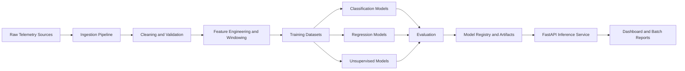

# Cloud Telemetry Intelligence Platform

An end-to-end machine learning system for ingesting cloud and network telemetry, detecting anomalous behavior, predicting performance regressions, and serving low-latency inference through a production-style API.

## Why this project

This project is designed to mirror a real infrastructure ML workflow rather than a demo-only model notebook. It focuses on:

- telemetry ingestion at scale
- data cleaning and feature engineering
- supervised and unsupervised ML
- regression and classification
- evaluation with operational metrics
- API deployment and reproducible experiments

The goal is to build something that looks credible for cloud, networking, observability, and ML engineering roles.

## Core use cases

The platform solves three related problems from the same telemetry stream:

1. Classification: determine whether a recent telemetry window contains an anomaly.
2. Regression: predict near-future latency, throughput degradation, or failure rate.
3. Unsupervised learning: detect novel or weakly labeled failure patterns with anomaly detection and clustering.

## Example input data

The system is intended to ingest telemetry such as:

- CPU utilization
- memory usage
- network latency
- packet drops
- request throughput
- error rates
- service health events
- structured log summaries

Input data can come from:

- public telemetry or anomaly datasets
- synthetic telemetry generated with controlled fault injection
- exported CSV, JSON, Parquet, or SQL-backed records

## Planned architecture



## Target tech stack

- Python
- pandas
- NumPy
- scikit-learn
- XGBoost
- PyTorch or TensorFlow for optional neural baselines
- FastAPI
- PostgreSQL
- Docker
- Matplotlib
- Jupyter
- pytest
- GitHub Actions

## Proposed repository structure

```text
cloud-telemetry-intelligence-platform/
  README.md
  data/
    raw/
    processed/
    synthetic/
  notebooks/
    01_exploration.ipynb
    02_feature_engineering.ipynb
    03_model_comparison.ipynb
    04_error_analysis.ipynb
  src/
    ingestion/
    features/
    models/
    training/
    evaluation/
    serving/
    db/
    utils/
  tests/
    ingestion/
    features/
    models/
    serving/
  docker/
  scripts/
  configs/
```

## Detailed build plan

### Phase 1: Ingestion layer

Build a reproducible ingestion pipeline that accepts metrics and event data from CSV, JSON, or SQL sources.

Required work:

- create schemas for metrics, events, and labels
- validate timestamps, service identifiers, and host identifiers
- support batch ingestion from local files
- store raw and cleaned data separately
- add data quality checks for null spikes, duplicate rows, and invalid ranges

Implementation notes:

- Use `pandas` for initial file loaders.
- Use `SQLAlchemy` or direct PostgreSQL connectors for persistence.
- Make each ingestion job idempotent so reruns do not duplicate records.

Current status:

- implemented a Phase 1 ingestion package under `src/cloud_telemetry_intelligence_platform/ingestion/`
- supports CSV, JSON, JSONL, and SQLite telemetry inputs
- validates timestamps, service IDs, host IDs, and known metric ranges
- archives raw inputs into `data/raw/`
- writes curated normalized records into `data/processed/curated/telemetry_records.csv`
- writes per-source ingestion reports and a checksum manifest under `data/processed/`
- skips already ingested files by checksum to keep reruns idempotent
- includes sample telemetry inputs in `data/synthetic/` and unit tests in `tests/`

### Phase 2: Cleaning and preprocessing

Prepare telemetry for model training.

Required work:

- impute or drop missing values depending on feature criticality
- standardize units and timestamp precision
- resample metrics into fixed windows such as 1 minute or 5 minute intervals
- normalize numerical features
- create rolling statistics such as mean, std, max, min, slope, and change rate
- join event summaries with metric windows
- generate labels for anomaly classification and regression targets

Key engineered features:

- rolling latency mean and variance
- request error ratio
- packet drop burst count
- CPU to throughput imbalance
- short-term versus long-term drift
- event frequency by component

Current status:

- implemented a preprocessing package under `src/cloud_telemetry_intelligence_platform/preprocessing/`
- standardizes timestamps into fixed windows and normalizes metric units into canonical forms
- writes cleaned telemetry rows to `data/processed/cleaned/telemetry_cleaned.csv`
- builds model-ready window features in `data/processed/features/window_features.csv`
- imputes missing metric values with prior observations or metric defaults
- computes rolling mean, std, min, max, and slope for each metric
- generates anomaly classification labels and next-window regression targets
- emits a preprocessing report under `data/processed/reports/preprocessing_report.json`

### Phase 3: Model development

Train and compare multiple model families.

Classification models:

- logistic regression baseline
- random forest classifier
- XGBoost classifier

Regression models:

- linear regression baseline
- random forest regressor
- XGBoost regressor

Unsupervised models:

- Isolation Forest
- KMeans for failure pattern clustering

Optional advanced model:

- sequence autoencoder or LSTM only if the dataset supports it and there is enough time for proper tuning

Current status:

- implemented a training package under `src/cloud_telemetry_intelligence_platform/training/`
- trains logistic regression and random forest classifiers for anomaly detection
- trains linear regression and random forest regressors for next-window latency and throughput
- trains Isolation Forest and KMeans for unsupervised anomaly scoring and failure-pattern clustering
- supports optional XGBoost models when `xgboost` is installed locally
- saves trained model artifacts under `artifacts/models/`
- writes a model comparison report to `data/processed/reports/training_report.json`

### Phase 4: Evaluation

Measure both predictive quality and operational usefulness.

Classification metrics:

- accuracy
- precision
- recall
- F1
- ROC-AUC
- confusion matrix

Regression metrics:

- RMSE
- MAE
- MAPE where appropriate

Operational metrics:

- inference latency
- batch scoring throughput
- false-positive rate under noisy load
- stability across services and time ranges

Analysis outputs:

- feature importance plots
- model comparison tables
- threshold sweeps
- error analysis notebooks
- ablations on feature groups

Current status:

- implemented an evaluation package under `src/cloud_telemetry_intelligence_platform/evaluation/`
- evaluates saved models across classification, regression, and unsupervised tasks
- measures operational metrics such as batch latency, p95 latency, throughput, and false-positive rate
- writes threshold sweeps, feature-ablation studies, and error-analysis CSVs under `data/processed/reports/`
- renders feature-importance SVG plots for models that expose coefficients or feature importances
- generates both Markdown and HTML dashboards for quick review

### Phase 5: Serving and deployment

Expose a lightweight inference API for real-time or batch scoring.

Serving requirements:

- FastAPI endpoint for anomaly classification
- FastAPI endpoint for regression prediction
- batch scoring endpoint for offline evaluation
- persisted prediction records in PostgreSQL
- Dockerized local deployment

Recommended API shape:

```text
POST /predict/anomaly
POST /predict/regression
POST /predict/batch
GET  /health
GET  /metrics
```

Current status:

- implemented a FastAPI serving package under `src/cloud_telemetry_intelligence_platform/serving/`
- loads trained artifacts from `artifacts/models/` using the saved training report
- exposes `/predict/anomaly`, `/predict/regression`, `/predict/batch`, `/health`, and `/metrics`
- converts telemetry observations plus optional recent history into the exact feature layout expected by the trained models
- logs prediction requests to `data/serving/predictions.jsonl` for local auditing
- includes API tests that train temporary models and verify live inference responses through FastAPI

### Phase 6: Reliability and developer workflow

Make the project feel like production-grade engineering rather than a notebook dump.

Required engineering work:

- unit tests for ingestion, feature transforms, and inference
- configuration files for experiments
- reproducible training scripts
- linting and formatting
- CI checks through GitHub Actions
- clear separation of raw, processed, and model artifact data

## How to build this project

The recommended implementation order is below.

### Step 1: Create the Python environment

Use Python 3.11 or newer.

```bash
python3 -m venv .venv
source .venv/bin/activate
pip install --upgrade pip
```

Install the expected dependencies once `requirements.txt` or `pyproject.toml` is added:

```bash
pip install pandas numpy matplotlib scikit-learn xgboost fastapi uvicorn sqlalchemy psycopg[binary] jupyter pytest
```

For the current Phase 1 implementation, the ingestion pipeline itself uses the Python standard library so it can run immediately after cloning without extra runtime dependencies.

Optional deep learning extras:

```bash
pip install torch
# or
pip install tensorflow
```

For the current repository state, the core model training dependencies are captured in `requirements.txt`. A local setup looks like:

```bash
python3 -m venv .venv
source .venv/bin/activate
pip install -r requirements.txt
```

### Step 2: Stand up local services

Run PostgreSQL locally, either through Docker or a local install.

Example with Docker:

```bash
docker run --name telemetry-postgres \
  -e POSTGRES_USER=telemetry \
  -e POSTGRES_PASSWORD=telemetry \
  -e POSTGRES_DB=telemetry_ml \
  -p 5432:5432 \
  -d postgres:16
```

### Step 3: Prepare or generate telemetry data

Start with one of these paths:

- import a public dataset and convert it to a unified schema
- generate synthetic telemetry with injected faults such as latency spikes, packet loss, and throughput collapse

Minimum dataset fields:

- timestamp
- service_name
- host_id
- cpu_pct
- memory_pct
- latency_ms
- throughput_rps
- error_rate
- packet_drop_pct
- event_summary
- anomaly_label

### Step 4: Build ingestion jobs

Implement loaders that:

- read raw files from `data/raw/`
- validate schema and ranges
- write cleaned tables to PostgreSQL
- export curated training data to `data/processed/`

The repository already includes a working local ingestion pipeline. Run it from the repo root with:

```bash
PYTHONPATH=src python3 -m cloud_telemetry_intelligence_platform.ingestion.cli \
  --project-root . \
  --input data/synthetic/sample_metrics.csv \
  --input data/synthetic/sample_events.jsonl
```

This command will:

- archive raw inputs under `data/raw/<run_id>/`
- generate per-source reports under `data/processed/reports/`
- update the checksum manifest at `data/processed/manifests/ingestion_manifest.json`
- append clean records to `data/processed/curated/telemetry_records.csv`

SQLite sources are supported as well:

```bash
PYTHONPATH=src python3 -m cloud_telemetry_intelligence_platform.ingestion.cli \
  --project-root . \
  --input path/to/telemetry.db \
  --sql-table telemetry
```

### Step 5: Build feature pipelines

Implement reusable transforms for:

- rolling windows
- lag features
- rate-of-change features
- normalization
- label generation

Persist processed features so training and serving use the same logic.

The repository already includes a working preprocessing pipeline. After ingestion, run:

```bash
PYTHONPATH=src python3 -m cloud_telemetry_intelligence_platform.preprocessing.cli \
  --project-root . \
  --window-minutes 1 \
  --rolling-window-size 3
```

This command will:

- read `data/processed/curated/telemetry_records.csv`
- standardize metric units such as percent to ratio
- build fixed 1-minute windows per service and host
- impute missing metrics using the most recent value or a metric default
- compute rolling statistics and z-score normalization
- generate `is_anomaly`, `target_next_latency_ms`, and `target_next_throughput_rps`
- write cleaned and feature-engineered outputs under `data/processed/`

### Step 6: Train baselines first

Start with simple models before deep learning:

- logistic regression for anomaly classification
- linear regression for next-step latency
- Isolation Forest for unsupervised anomaly detection

Then add tree-based models and compare quality against the baselines.

The repository already includes a working training pipeline. After preprocessing, run:

```bash
PYTHONPATH=src .venv/bin/python -m cloud_telemetry_intelligence_platform.training.cli \
  --project-root . \
  --test-size 0.4 \
  --random-state 42
```

This command will:

- read `data/processed/features/window_features.csv`
- select numeric feature columns automatically
- train classification, regression, and unsupervised baseline models
- save model artifacts under `artifacts/models/`
- write a comparison report to `data/processed/reports/training_report.json`

### Step 7: Evaluate and document results

Create notebooks and scripts that:

- compare model performance
- visualize false positives and misses
- analyze feature importance
- measure inference latency
- summarize tradeoffs between supervised and unsupervised methods

The repository already includes a working evaluation pipeline. After training, run:

```bash
PYTHONPATH=src .venv/bin/python -m cloud_telemetry_intelligence_platform.evaluation.cli \
  --project-root .
```

This command will:

- read the saved training report and model artifacts
- recompute evaluation metrics on the current feature set
- benchmark inference latency and throughput
- generate threshold sweeps for probabilistic classifiers
- run feature-group ablations by zeroing feature families
- export Markdown and HTML dashboards under `data/processed/reports/`

### Step 8: Add a serving layer

Train, serialize, and load the selected models in FastAPI. Add request validation and basic observability.

Run the service locally:

```bash
PYTHONPATH=src .venv/bin/uvicorn cloud_telemetry_intelligence_platform.serving.api:app --reload
```

You can then call the API with a payload shaped like:

```json
{
  "service_name": "edge-api",
  "host_id": "host-01",
  "window_start": "2026-04-14T10:12:30Z",
  "window_minutes": 1,
  "rolling_window_size": 3,
  "history": [
    {
      "cpu_utilization": 0.7,
      "latency_ms": 120.0,
      "throughput_rps": 900.0,
      "error_rate": 0.02
    }
  ],
  "observations": [
    {
      "timestamp": "2026-04-14T10:12:05Z",
      "metric_name": "cpu_pct",
      "metric_value": 88.0,
      "unit": "percent"
    },
    {
      "timestamp": "2026-04-14T10:12:35Z",
      "metric_name": "packet_drop_pct",
      "metric_value": 3.0,
      "unit": "percent",
      "event_type": "event",
      "event_summary": "packet loss burst"
    }
  ]
}
```

Example endpoints:

```bash
curl -X POST http://127.0.0.1:8000/predict/anomaly \
  -H "Content-Type: application/json" \
  -d @payload.json
```

### Step 9: Add tests and CI

At minimum, add:

- schema validation tests
- feature pipeline tests
- model smoke tests
- API contract tests

Then configure GitHub Actions to run linting, tests, and basic build checks on every pull request.

The current test suite can be run with:

```bash
PYTHONPATH=src python3 -m unittest discover -s tests -v
```

## Recommended milestones

1. Telemetry schema, ingestion pipeline, and data validation
2. Feature engineering and baseline notebooks
3. Classification, regression, and unsupervised model training
4. Evaluation dashboard and experiment comparison
5. FastAPI inference service and PostgreSQL integration
6. Docker packaging, tests, and CI

## What success looks like

This project is successful if it can:

- ingest realistic telemetry data reproducibly
- detect anomalous windows with strong precision and recall
- predict performance degradation with reasonable error bounds
- compare supervised and unsupervised methods credibly
- serve predictions through a clean API
- demonstrate strong ML and software engineering practices in one repository

## Resume-ready summary

Built an end-to-end ML platform for cloud and network telemetry that ingests, cleans, and models time-series infrastructure data for anomaly detection and performance regression prediction using Python, pandas, scikit-learn, and FastAPI.
